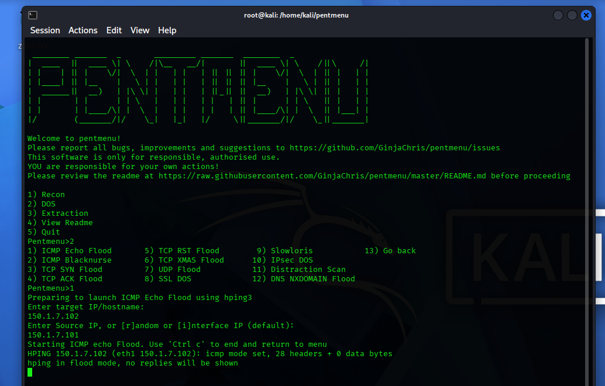
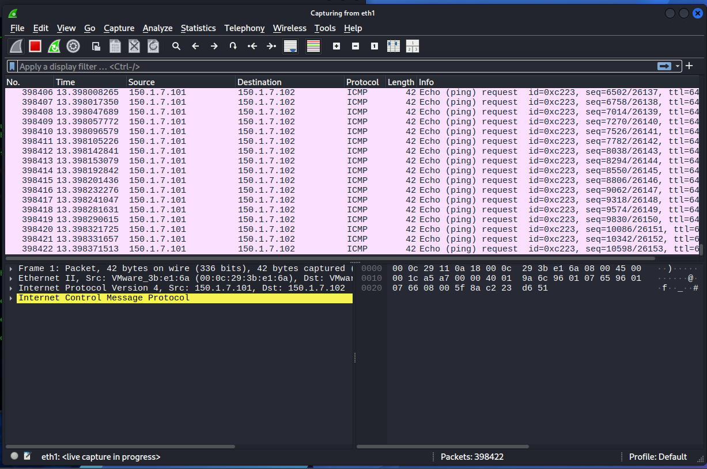
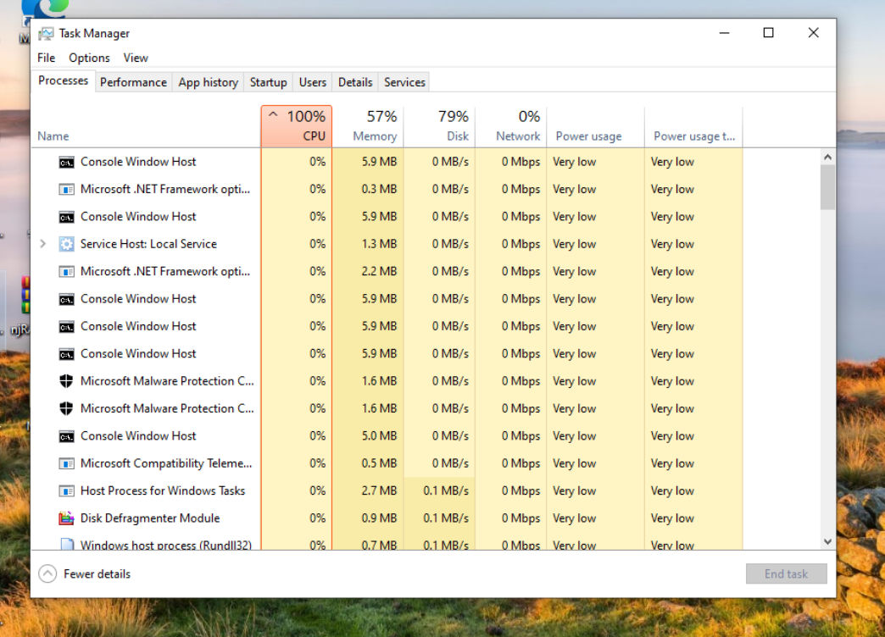
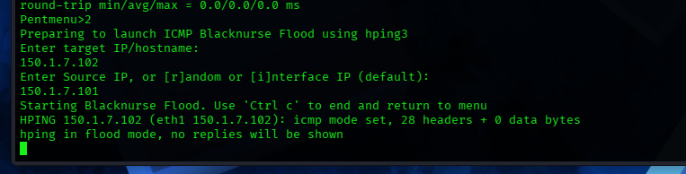
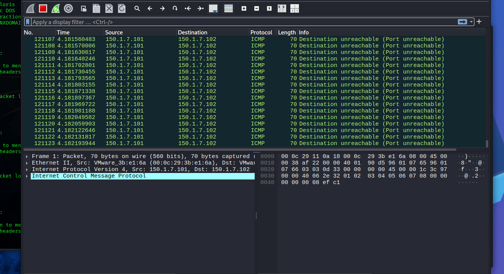
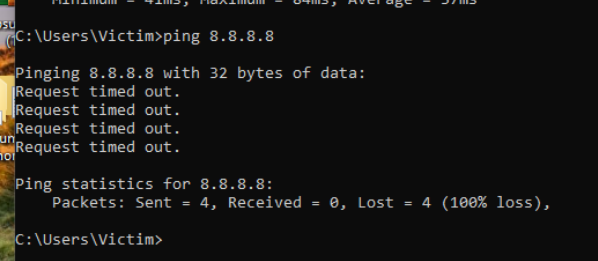
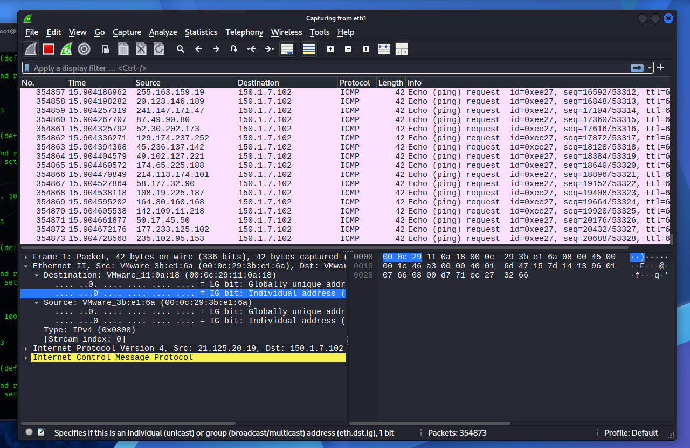
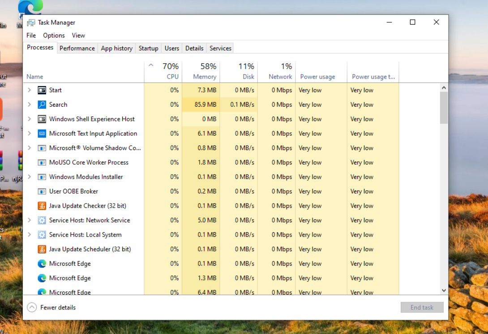
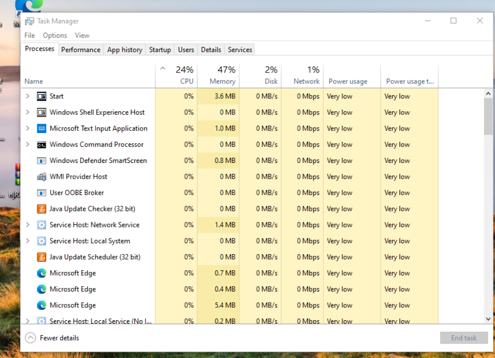
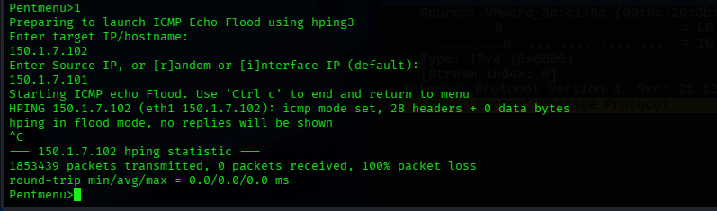

# ICMP Flood Attack & Defense Lab

Cybersecurity coursework lab (CEH - Corvit) demonstrating ICMP flood attacks
and mitigation techniques in an isolated VM environment.

## Lab Environment
- **Attacker:** Kali Linux VM (150.1.7.101)
- **Victim:** Windows VM (150.1.7.102)
- **Attack Tool:** pentmenu (hping3 backend)
- **Monitoring:** Wireshark, Windows Task Manager

⚠️ Performed strictly in an isolated lab network for educational purposes only.

## Part A: Attack Methods (3 Techniques)

### Method 1: ICMP Echo Flood (Direct Source)
Standard ICMP Echo Request flood from real source IP, using pentmenu's
ICMP Echo Flood module.

### Method 2: ICMP Blacknurse Flood
Sends ICMP Type 3 (Destination Unreachable) Code 3 (Port Unreachable)
packets — low bandwidth, high CPU cost technique.

### Method 3: ICMP Echo Flood — Randomized Source IP
Same Echo Flood module, source set to random per-packet, defeating
simple IP-based blocking.

## Part B: Defense Techniques (3 Layers)

### Defense 1: Host-Based Firewall Rule

netsh advfirewall firewall add rule name="Block_Kali_ICMP" protocol=icmpv4:8,any dir=in remoteip=150.1.7.101 action=block

Result: CPU usage dropped from 100% to 24% during repeat flood.

**Limitation:** Only blocks known source IPs — ineffective against
randomized-source floods (Method 3).

### Defense 2: Network-Level ICMP Rate-Limiting (Gateway)

policy-map ICMP-LIMIT
class class-default
police cir 8000 conform-action transmit exceed-action drop
!
interface GigabitEthernet0/0
service-policy input ICMP-LIMIT

Caps ICMP throughput at the network edge regardless of source IP —
mitigates spoofed/randomized floods that host-based rules can't stop.

### Defense 3: Dedicated DDoS Mitigation Appliance
Given unlimited budget: **Cisco Firepower NGFW** or **F5 BIG-IP DDoS
Hybrid Defender**, performing hardware-level flood detection and
dropping malicious traffic at line-rate before reaching internal hosts.

## Conclusion
ICMP floods can fully saturate a target's CPU and network stack using a
single lightweight tool. Host-based defenses work against fixed-source
attacks but fail against spoofed traffic — full protection requires
layered defense combining host, network, and dedicated hardware controls.

## Tools Used
- [pentmenu](https://github.com/GinjaChris/pentmenu)
- hping3
- Wireshark

